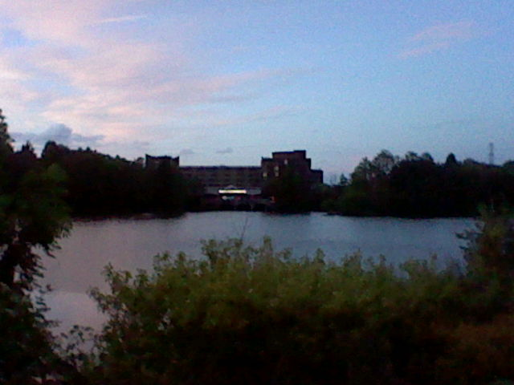
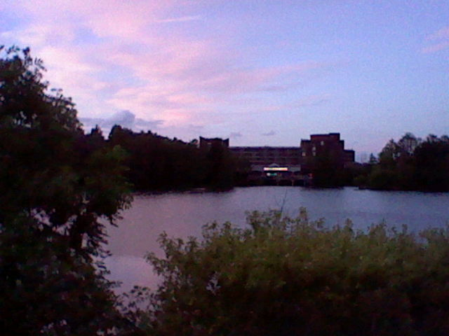
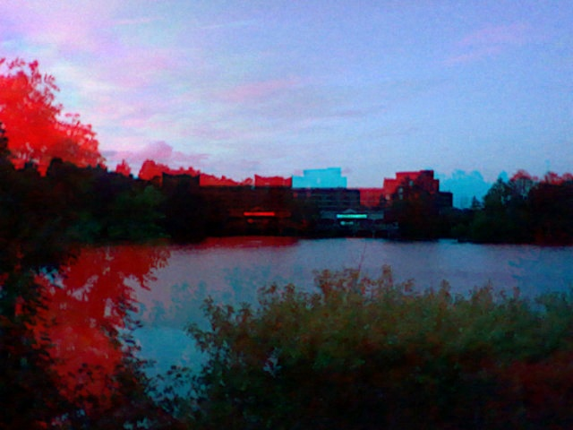

# 3ds-extract
Scripts to extract images from Nintendo 3DS pictures
A script to extract the separate images from a Nintendo 3DS.

## Usage

Input: *.MPO files in the same folder as the script
Output: *_left, *_right, *combined.jpg in processed/

```bash
python extract.py
```

Splits the images in to two separate images. Also creates a combined image merging the Red and Blue/Green channels.

Left:

Right:

Merged:
